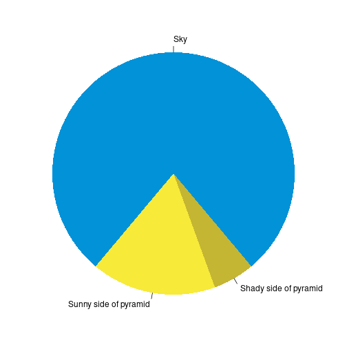

<script type="module">
  document.addEventListener("DOMContentLoaded", function(e) {
console.log("hi");
let game = document.getElementsByTagName("h2");

console.log(game);
let pgn_str = game[0].innerHTML;

console.log(pgn_str)
console.log("That was our pgn");

const lpv = LichessPgnViewer(game, {
pgn: pgn_str,
});
  });
  </script>

Hello! Welcome to my website!

I am a Senior at Virginia Tech majoring in Computational Modeling and Data Analytics (CMDA) & Statistics. I have published 3 papers, through my research on Privacy and Linguistics, and am currently curious about the current intelligence gathering systems, most notably the Large Language Model paradigm.


Below is a in-progress analysis of chess <a href="https://database.lichess.org/" target="_blank">data</a> from Lichess, over the month of April, 2023. 

### Why should you care?

<font size="4"> *Because it's awesome!*. </font> Also look look look at the pretty movie I made:


Alright with the introduction out of the way let's get into this.

### Challenge

- People play *a lot* of chess

**108 million games were played**, with a compressed size of 33.7 GB. 

The zst compression algorithm used is estimated to compress the file size by around 7 times, leading to a total file size of **210 GB**. While my computer does theoretically have enough space, in practice, I do not. Fortunately, this storage space is remarkably cheap and easy to get nowadays from simply a usb stick. 


The other technical limitation that this size of data provides relates to the working memory of the computer. To process data, most computer programs look at every single field, and anything that is relevant is temporarily saved and remembered. This capacity to remember the results requires a large enough memory capacity. As of time of writing, 8GB seems to be the default for average consumer laptops. Thus, the typical process, which presumes an in-memory approach, will not be sufficient. 
For example, here is a *very simplified* overview and pseudo-code of what the process may look like
```
for data_row in dataset {
    for specific_item in data_row {
        if is.na(specific_item) {
            remove(data_row)
        }
        if is.character(specific_item) {
            as.numeric(specific_item)
        }
    }
}
```

Note that the object dataset must be defined and able to be evaluated at *all times*. I.E., held in memory (and not lazily evaluated). The solution? Databases.

<div class="figure">

<p class="caption">plot of chunk unnamed-chunk-1</p>
</div>

#### Databases

For this project, I used <a href="https://www.postgresql.org/" target="_blank">Postgres</a> (also and henceforth known as Postgres), due to its wide application across the industry and extensive documentation. Postgres is a client-server model, which means that it runs on a server, and supports multiple connections at once. This provides the advantage of defining user roles for security, and ease of connection, as there is no fundamentally different process having one or multiple computers talk to the database at the same time. This project fundamentally would have been easier with DuckDB (designed for the medium data use case), but this provides the affordance to practice with an industry-standard tool.

Setting up Postgres was surprisingly not trivial, as there were user permission conflicts along the way, however, once set up, it has been easy to work with. 

#### Data Wrangling

Concurrently on setting up the database, I was writing code to break down the database record into something that 1) I could put into the database as a useful format and 2) I could analyse more easily. Below is an example of the format that the data was in before processing:

```
[Event "Rated Bullet tournament https://lichess.org/tournament/yc1WW2Ox"]
[Site "https://lichess.org/PpwPOZMq"]
[Date "2017.04.01"]
[Round "-"]
[White "Abbot"]
[Black "Costello"]
[Result "0-1"]
[UTCDate "2017.04.01"]
[UTCTime "11:32:01"]
[WhiteElo "2100"]
[BlackElo "2000"]
[WhiteRatingDiff "-4"]
[BlackRatingDiff "+1"]
[WhiteTitle "FM"]
[ECO "B30"]
[Opening "Sicilian Defense: Old Sicilian"]
[TimeControl "300+0"]
[Termination "Time forfeit"]

1. e4 { [%eval 0.17] [%clk 0:00:30] } 1... c5 { [%eval 0.19] [%clk 0:00:30] }
2. Nf3 { [%eval 0.25] [%clk 0:00:29] } 2... Nc6 { [%eval 0.33] [%clk 0:00:30] }
3. Bc4 { [%eval -0.13] [%clk 0:00:28] } 3... e6 { [%eval -0.04] [%clk 0:00:30] }
4. c3 { [%eval -0.4] [%clk 0:00:27] } 4... b5? { [%eval 1.18] [%clk 0:00:30] }
5. Bb3?! { [%eval 0.21] [%clk 0:00:26] } 5... c4 { [%eval 0.32] [%clk 0:00:29] }
6. Bc2 { [%eval 0.2] [%clk 0:00:25] } 6... a5 { [%eval 0.6] [%clk 0:00:29] }
7. d4 { [%eval 0.29] [%clk 0:00:23] } 7... cxd3 { [%eval 0.6] [%clk 0:00:27] }
8. Qxd3 { [%eval 0.12] [%clk 0:00:22] } 8... Nf6 { [%eval 0.52] [%clk 0:00:26] }
9. e5 { [%eval 0.39] [%clk 0:00:21] } 9... Nd5 { [%eval 0.45] [%clk 0:00:25] }
10. Bg5?! { [%eval -0.44] [%clk 0:00:18] } 10... Qc7 { [%eval -0.12] [%clk 0:00:23] }
11. Nbd2?? { [%eval -3.15] [%clk 0:00:14] } 11... h6 { [%eval -2.99] [%clk 0:00:23] }
12. Bh4 { [%eval -3.0] [%clk 0:00:11] } 12... Ba6? { [%eval -0.12] [%clk 0:00:23] }
13. b3?? { [%eval -4.14] [%clk 0:00:02] } 13... Nf4? { [%eval -2.73] [%clk 0:00:21] } 0-1
```

This is already a very useful format. Data that I did not extract includes the date, time, round, and any title information. I did not have any questions that I wanted answers to that included the first three fields, and I feel that the granularity of the rating field encompasses any differences between titled and non-titled players. 

Due to the zst decompression algorithm I used, the game was lumped together, rather than including line breaks. This provided a benefit of ensuring the game data was all analyzed, however, provided less than optimal slices of the data, leading to slightly more fragile code. For example, ```1. e4 1-0``` is a valid game that currently my code throws away. Additionally, any game that does not have clock data is not handled.

A useful utility that the script includes, to catch and troubleshoot these cases is a debug mode that allows me to print out specific game or line numbers. Very useful for validation, and fixing edge-cases that arise. Anything that my script fails at parsing gets thrown into a log.txt file.
Ommitted games include in-progress games

#### Data Analysis

One of the main reasons that I embarked upon this project was that I knew that I could use normal R syntax to query and transform the database data, through the <a href="https://dbplyr.tidyverse.org/" target="_blank">dbplyr</a> package. The alternative approach is to code in SQL, which while it functions well, does not provide the same level of fluency in manipulation. Additionally, to explore further, or to plot the results, conversion into an R dataframe would be required, slowing down fluency due to context switching. 

<font size = "4"> **However, I have a problem.** </font>

The dbplyr package has interpreted the integer array datatype, or rather any array datatype, as just a string. So, instead of being able to select indices, and determine the length of the array, I am left with a string that looks like this:

```r
"{180, 166, 165, 130, 124, 121, 88, 84, 59, 51, 23, 18, 5, 0}"
```
I can extract out characters 2 through 4, to grab 180, but would need to remove the curly braces and split along the commas in order to convert this into a useable format. Not only is this extra work in conversion, this process only makes sense for in-memory operations. Our first challenge bites us again!

Reloading and reformating the data into the database (According to ACID principles) circumvented this issue. Revisiting the parser also allowed me to rename some variables, fix an error spotted during a preliminary exploration phase, and allow consolidation of the codebase.

#### Parser speed

One last struggle that I have been dealing with intermittently is speed. I have transitioned from ```INSERT``` statements in psycopg2, to batch inserts in psycopg2, to ```COPY``` in psycopg2 (requiring binary or csv format), to ```COPY``` statements in psycopg**3**, with the later statements providing speedup over the basic insert statement. However, I still seem to be garnering speeds similar to insert statements, rather than bulk entry. I have turned off auto-commit, minimized fsyncs, and enlarged wal_size (among other edits), to no significant speedup. 

 - The fastest that I have loaded data in (with toy data from this link: https://github.com/psycopg/psycopg/discussions/411) is 10,000 in 3.5 seconds. I am writing to 4 different tables with many more fields and values, and I presume there is more overhead. This post also seems to indicate that development computers running Linux may be 2x faster. 
Note that my speed for inserting data seems to be in line with the metrics on this post https://stackoverflow.com/questions/5131266/increase-postgresql-write-speed-at-the-cost-of-likely-data-loss.

I am assuming two things: 
1) My code for batching the operations together is not performing exactly how I expect it to. This seems quite plausible.

I did not see an improvement in speed from switching from the usb to my main computer (with a now cleared memory).

Regardless, to load in the data, this would take 27 hours. 


### Extra Technical Issues:

- Github (with multiple branches) and virtual environments were hooked up at the same time. Much loss of data and pain
- Site failed knitting, because I had a virtual environment inside a virtual environment, and because of git issues I moved to a new folder. Need to run ```knitr::knit("_index.Rmd")``` instead of relying on R blogdown to automatically do it


### Preliminary Results
As the data has not been fully analyzed, here are some very basic plots of the data (presuming that the database is currently online):

<div class="figure">

<p class="caption">plot of chunk unnamed-chunk-3</p>
</div>

```
## Error in (function (cond) : error in evaluating the argument 'drv' in selecting a method for function 'dbConnect': there is no package called 'RPostgres'
## Error in tbl(con, "metadata"): object 'con' not found
## Error in filter(., time_control < 1500): object 'meta' not found
```

We see the biggest peak at 1500. This is a default rating that lichess provides. Additionally, we see a peak at around 1350. My hypothesis is that most players lose their first game, and play the second game having lost around 150 points. Note that this plot shows the doesn't show the players ratings, but rather a weighted average of players ratings. It seems probable that those who are better at chess (even though there are fewer of them) play more games. This graph then is a convolution of two different underlying distributions, which explains why the mean is 1619, as shown below.


```r
meta %>% dlookr::describe()
## Error in dlookr::describe(.): object 'meta' not found
```

An excellent package by the way; happens to support database connection objects, and provides a nice summary. 
Another interesting graph is the amount of games played per time control (excluding delay). So, note that a 3 minute game + 2 second increment per move is lumped in the same category as 3+0. This will be investigated more in the future.


```r
meta %>% 
    filter(time_control < 1500) %>%
    ggplot(aes(x=white_elo)) +
    geom_histogram(bins = 100) +
    theme_bw()
## Error in filter(., time_control < 1500): object 'meta' not found
```


This is code that will show an interesting game that I found. 


```r
library(httr)
library(htmltools)
res = GET("https://lichess.org/game/export/NVkwFkVs")
pgn <- content(res, "text")
## No encoding supplied: defaulting to UTF-8.
```

<div>
<h2></h2>
</div>

As of writing, however, the javascript package to load the game in a playable format is having trouble being compiled.


So on that note I leave you all with a pie chart


```r
par(mar = c(0, 1, 0, 1))
pie(
  c(280, 60, 20),
  c('Sky', 'Sunny side of pyramid', 'Shady side of pyramid'),
  col = c('#0292D8', '#F7EA39', '#C4B632'),
  init.angle = -50, border = NA
)
```


